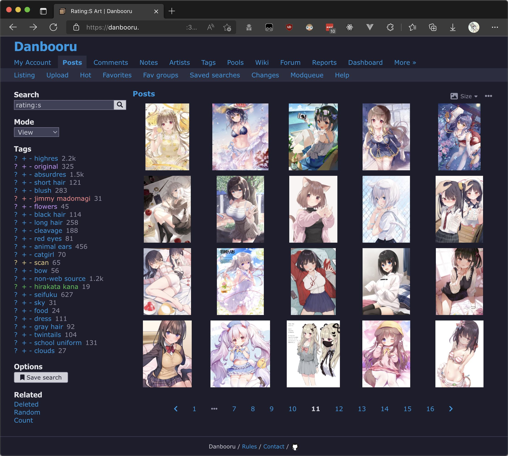

# booru-scripts

Incrementally sync your favorites on [moebooru](https://github.com/moebooru/moebooru) websites to your own [danbooru](https://github.com/danbooru/danbooru) website. 

In this repo, moebooru typically means [konachan.com](https://konachan.com) and [yande.re](https://yande.re).

增量同步你在 [moebooru](https://github.com/moebooru/moebooru) 网站上的收藏到你自己的 [danbooru](https://github.com/danbooru/danbooru) 网站。

在这个仓库中，moebooru 一般指 [konachan.com](https://konachan.com) 和 [yande.re](https://yande.re).

- [x] Upload original images
- [x] Sync tags and post metadata
- [ ] Sync metadata for tags
- [ ] Sync parent/child relationships
- [ ] Sync pools

## Use-case 案例

As computer nerds and anime/manga art lovers,  everyone wants their favorite images on moebooru to be stored locally, so that we can appreciate them later. However, if you just download them to you hard drive, there are no longer tags (a big feature in image boards like moebooru) holding the images together. With no tags, you will have a hard time finding related images by tags. Also, viewing the large original files is a suboptimal experience, especially for mobile devices. 

Even when you try to use some photo-managing software to organize the images, tagging all those images is still a pain in the ass.

Why not self-hosting a [danbooru](https://github.com/danbooru/danbooru) instance and use this script to sync your favorite images on moebooru to your own website! You will have the same experience as moebooru websites with all the advantages of self-hosted websites. (since moebooru is a fork from danbooru, they are similar.)

作为计算机折腾人士和动画/漫画作品爱好者，许多人都希望他们在 moebooru 上的收藏下载到本地，方便以后欣赏。但是如果我们之间下载这些图片到电脑，那么维持这些图片之间的关系的图片 tag 就没了（这是 moebooru 这些 image boards 的最大的特点）。没有了 tag，那通过 tag 寻找相关图片就很难受了，而且查看这些巨大的原图体验也不好，尤其对于移动设备来说。

就算你想用照片管理工具来管理这些图片，给这么多图片打标签也是很~~操蛋~~的。

为什么不自建一个 [danbooru](https://github.com/danbooru/danbooru) 实例，然后用这个脚本来同步你在 moebooru 上的收藏到你自己的网站呢！你仍然会拥有与在 moebooru 网站相同的体验，同时又有自建网站的所有优势。（moebooru 是 danbooru 的 fork，它们差不多）

This script will first download the original images and metadata of your favorites posts from moebooru. Then it will create posts on your danbooru instance with the downloaded image and metadata.

这个脚本会先下载你在 moebooru 上收藏的原图，然后会用下载的图片和元数据在你自己的 danbooru 网站上创建 posts。

The reason why I download the images first is that I cannot directly access the moebooru websites in my country. I have to use a proxy on my computer 

Screenshot of a self-hosting danbooru instance:

自建 danbooru 实例的截图：

## How to use 怎么使用

Make sure `GNU make`, `curl`, `wget`,  `node`, and `yarn` are installed. Steps below are based on a unix-like OS. If you are using Windows, try WSL.

确保你安装了 `GNU make`, `curl`, `wget`,  `node` 和 `yarn`。以下步骤基于类 Unix 系统，如果你使用 Windows 的话请尝试 WSL。

1. Prepare environment variables 准备环境变量

   - **`MOEBOORU_USERNAME`**: your username on moebooru
     - set it by `export MOEBOORU_USERNAME=username`

   - **`MOEBOORU_HOST`**: moebooru host, e.g. `https://konachan.com` (don't forget http/https)
     - set it by `export MOEBOORU_HOST=https://konachan.com`

   - **`DANBOORU_HOST`**:  your self-hosted danbooru, e.g. `https://danbooru.example.com` (don't forget http/https)
     - set it by `export DANBOORU_HOST=https://konachan.com`
     - (recommanded) or putting `DANBOORU_HOST=https://konachan.com` in a `.env` file at repo root

   - **`DANBOORU_USERNAME`**: username of your self-hosted danbooru account
     - set it by `export DANBOORU_USERNAME=username`
     - (recommanded) or putting `DANBOORU_USERNAME=username` in a `.env` file at repo root

   - **`DANBOORU_APIKEY`**: api key of your self-hosted danbooru account (you can create one from account profile page)
     - set it by `export DANBOORU_APIKEY=key`
     - (recommanded) or putting `DANBOORU_APIKEY=key` in a `.env` file at repo root

   - **`PROXY`**: proxy to use when accessing moebooru websites (because there is no direct access in my country), e.g. `http://127.0.0.1:9999`
     - skip this if you don't need a proxy
     - set it by `export PROXY=http://yourproxy:1234`

   - **`IMAGE_DIR`**: path to directory, where to store downloaded images
     - default value: `~/Pictures/${MOEBOORU_HOSTNAME}`. For example, if you set `MOEBOORU_HOST` as `https://konachan.com`, then `IMAGE_DIR` will be `~/Pictures/konachan.com`
     - set it by `export IMAGE_DIR=./your-dir`

2. Start syncing 开始同步

   - Run `make get_favorites_and_sync_to_danbooru` to download and sync your favorites to self-hosted danbooru.

   - 
More actions will be added later after some testing...
